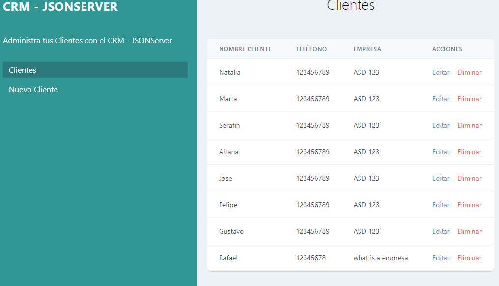

# Proyecto 2 - CRM - CRUD - REST

## Descripción

Este proyecto es un CRUD de un sistema de CRM (Customer Relationship Management) que permite 'gestionar' clientes guardandolos en una base de datos local del navegador cliente (IndexedDB).

Al ser una base de datos local, los datos no se guardan en un servidor, por lo tanto solo son accesibles desde el navegador donde se guardaron, en caso de que la cache del navegador sea limpiada, el ordenador formateado o se utilice otro navegador los datos se perderan o no seran accesibles.

### Instrucciones sobre IndexedDB

[IndexedDB](./IndexedDB.md)

## Estructura del Proyecto

- CSS
> Contiene los estilos de la aplicación.
- JS
> Contiene los scripts de la aplicación.
> - `API.js`: Contiene las funciones que interactuan con la base de datos.
> - `app.js`: Contiene las funciones que interactuan con la interfaz de usuario.
> - `funciones.js`: Contiene funciones de utilidad y validacion de datos.
> - `editarcliente.js`: Contiene las funciones que permiten editar un cliente.
> - `nuevocliente.js`: Contiene las funciones que permiten agregar un nuevo cliente.
- RAIZ
> - `index.html`: Contiene la estructura de la aplicación.
> - `editar-cliente.html`: Contiene la estructura de la página para editar un cliente.
> - `nuevo-cliente.html`: Contiene la estructura de la página para agregar un nuevo cliente.
> - `README.md`: Contiene la descripción del proyecto.
> - `IndexedDB.md`: Contiene las instrucciones sobre IndexedDB.

## Estructura de JavaScript

### API.js

- ``webInitonLoad()``: Inicializa la base de datos.
- ``mostrarError(evento)``: Muestra un mensaje de error en la consola.
- ``iniciarBaseDatos(evento)``: Inicializa la base de datos.
- ``crearAlmacen(evento)``: Crea un almacen en la base de datos.
- ``agregarCliente(cliente)``: Agrega un cliente a la base de datos.
- ``eliminarCliente(id)``: Elimina un cliente de la base de datos.
- ``obtenerCliente(id)``: Obtiene un cliente de la base de datos.
- ``actualizarCliente(id, cliente)``: Actualiza un cliente en la base de datos.

### app.js

- ``onLoadWindows()``: Carga los clientes de la base de datos al cargar la página.
- ``mostrarClientes()``: Muestra los clientes en la interfaz de usuario.
- ``mostrarClientesCursor(evento)``: Muestra los clientes en la interfaz de usuario.
- ``limpiarHTML()``: Limpia el HTML de la lista de clientes.

- ``addEventListener = load``: Inicializa la base de datos.

### funciones.js

- ``mostrarError(mensaje)``: Muestra un mensaje de error en la consola.
- ``validarNombre(nombre)``: Valida el campo nombre.
- ``validarEmail(email)``: Valida el campo email.
- ``validarTelefono(telefono)``: Valida el campo telefono.
- ``validarCampoNombre()``: Valida el campo nombre.
- ``validarCampoEmail()``: Valida el campo email.
- ``validarCampoTelefono()``: Valida el campo telefono.
- ``validarCampoEmpresa()``: Valida el campo empresa.

- ``addEventListener = blur``: Valida los campos del formulario.

### nuevocliente.js

- ``onLoadWindows()``: Carga los clientes de la base de datos al cargar la página.
- ``validarFormularioEnEnvio(evento)``: Valida el formulario al enviarlo.

- ``addEventListener = load``: Inicializa la base de datos.
- ``addEventListener = submit``: Valida el formulario al enviarlo.

### editarcliente.js

- ``onLoadWindows()``: Carga los clientes de la base de datos al cargar la página.
- ``llenarFormulario(evento)``: Llena el formulario con la información del cliente seleccionado.
- ``validarFormularioEnEnvio(evento)``: Valida el formulario al enviarlo.

- ``addEventListener = load``: Inicializa la base de datos.
- ``addEventListener = submit``: Valida el formulario al enviarlo.

## Funcionalidades

#### Agregar un nuevo cliente.
- Permite agregar un nuevo cliente a la base de datos con la información proporcionada en el formulario. (``Nombre``, ``Email``, ``Teléfono``, ``Empresa``)
  - Al agregar un nuevo cliente tambien se autogenera un ID.

#### Editar un cliente.
- Permite editar la información de un cliente en la base de datos con la información proporcionada en el formulario. (``Nombre``, ``Email``, ``Teléfono``, ``Empresa``)

#### Eliminar un cliente.
- Permite eliminar un cliente de la base de datos.

#### Listado de Clientes.
- Muestra un listado de los clientes guardados en la base de datos.

## Ejemplo de utilizacion

1. Listado de clientes.

- Dando clic en el botón "Clientes" se muestra un listado de los clientes guardados en la base de datos.

2. Eliminar un cliente.

- Dando clic en el botón "Eliminar" se elimina un cliente de la base de datos. (Se elimino en este caso el Cliente con ID 1 Rafael)

3. Editar un cliente.

- Dando clic en el botón "Editar" se muestra un formulario con la información del cliente seleccionado, que podremos editar y guardar.

- Una vez guardado el cliente editado, se muestra el listado de clientes actualizado.

4. Agregar un nuevo cliente.

- Dando clic en el botón "Nuevo Cliente" se muestra un formulario para agregar un nuevo cliente.

- Una vez guardado el nuevo cliente, se muestra el listado de clientes actualizado.

